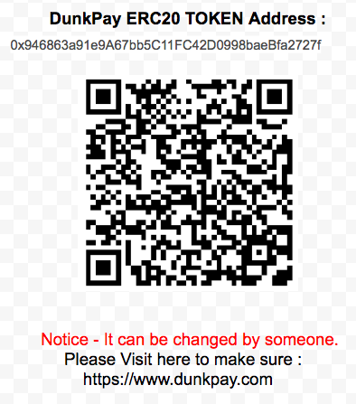

# Dear friends,

This white paper is related to selling DunkPay tokens. DunkPay is a service that allows you to make payments using your Cryptocurrency. If the user makes a payment through DunkPay, we will charge a purchase fee. In addition, we are developing services that link with offline by applying DunkPay. We decided to sell DunkPay's service profits as tokens. DunkPay is a running service. No specific sales terms or constraints. Refunds are also available at any time.

# Send ETH for buying , Send DNK for refunds.

Buying or selling DunkPay tokens does not require cryptocurrency exchanges. You can get DNK when you deposit ETH to a smart contract address. Or you can refund when you deposit the DNK. All functions such as purchases, refunds, bankruptcies, etc. operate as smart contracts.

<p align="center">
	<a href="https://etherscan.io/address/0x7b606Bc8ce7ba370b14BF5b43D1987Cbaadc8d6d">
	</a>
</p>

# DunkPay Token (ERC20 - DNK)
```
Total volume : 10,000,000 DNK
Sales volume : 4,900,000 DNK (49%)
Additional volume : PoS for token users.
```
# DunkPay Token PoS (Proof-of-Stake)

The rules are very simple. Take a snapshot on the first day of the month (GMT 00:00). You will receive a DunkPay token by PoS based on (holdings / total issue volume).  For PoS, you should have more than 1,000 DNK.
(However, if there is no fee income, it may carry forward.)
```
Ex., 
Nov 2018, Total fees of DunkPay commission - 1,200 ETH * 1000
On Dec 1, 2018, We will divide 1,200,000 DNK for each user (Holdings / Total Issue Volume) to PoS.

5,000 DNK holder = (5000/10000000) * 1200000 = Additional 600 DNK
```
# DunkPay Token Units 

Unit|Value|Jordan
 ------------- |-------------|:-----
 jordan (Jordan)     | 1 jordan | 1 
 Kjordan (Magic)     | 1e3 jordan | 1,000 
 Mjondan (Shaq)     | 1e6 jordan | 1,000,000 
 Gjordan (Kobe)     | 1e9 jordan | 1,000,000,000 
 microdunk (LeBron)     | 1e12 jordan | 1,000,000,000,000 
 millidunk (Stephan)    | 1e15 jordan | 1,000,000,000,000,000 
 dunk (DNK)     | 1e18 jordan | 1,000,000,000,000,000,000 

Apply the same units as ETH. 1 DNK can also be expressed as 1e18 jordan. Regretfully, Kobe and LeBron are not Jordan's opponents.

# DunkPay Token Buying (Purchase)

When a customer deposits ETH into a smart contract address, the customer immediately receives the token with the same ETH address as the DunkPay token. Up to 50% bonus will apply depending on remaining sales volume.
```
1 ETH = (100% + 50% * (Sales Remaining Volume / Total Issue volume)) * 1000 DNK

Ex., In case of : 2,450,000 DNK of 10,000,000 DNK is remains.
1 ETH = (1 + (0.5 * 0.245)) * 1000 = 1,122 DNK
```
# DunkPay Token Selling (Refund)

Customers can sell DunkPay tokens by running the Refund to Smart Contract address. It is reverse buying calculation. Up to 50% penalty will apply depending on remaining sales volume.

```
1 DNK = (50% + 50% * (Sales Remaining Volume / Total Issue Volume)) / 1000 ETH

Ex., In case of : 2,450,000 DNK  of 10,000,000 DNK is remains.
1,125 DNK = (562 + (562 * 0.245)) / 1000 = 0.699 ETH
```
# DunkPay Token Ending (bankruptcy)

DunkPay has an obligation to deposit the token refund reserve. However, if the reserve fund can not be provided due to the deterioration of management, the bankruptcy contract will be executed. The bankruptcy procedure is as follows. All tokens not sold will be burn in the first step. And we will divide remaining tokens for airdrop to token holders.

# DunkPay Token Operation Plan

The operation plan is very transparent. If the DunkPay token sale is successful, the ETH will be enforced for the company's development, with the exception of the refund reserve (10%). Expected execution portions are as follows.

<p align="center">
	
</p>

On the first day of each month, the contents of the execution are informed through the our site.

# Best-case Scenario

If DunkPay token sale is successful, we will maximize profits by contributing to the popularization of cryptocurrency. The funding profits will be used again for the development of a cryptocurrency payment service. We will distributed Point Of Sale (POS) equipment for self-employed persons. ATM (Automatic Teller Machine) service that managed by self-employed person will also be coming out. Ultimately, we will proceed with the development of a user-centered low-fee DEX (Decentralized Exchange) that improves the current problem of centralized exchanges.

# Conclusion

Nowadays, there are tons of tokens are currently being sale that guarantee high returns. However, it is hard to find a token that can expect profit rate right now. We do not want to sell products that do not look like air or water to you. Participate Token Sale that can get revenue immediately. You are eligible to purchase the visible items! 

Sincerely yours,

<br><br><br>