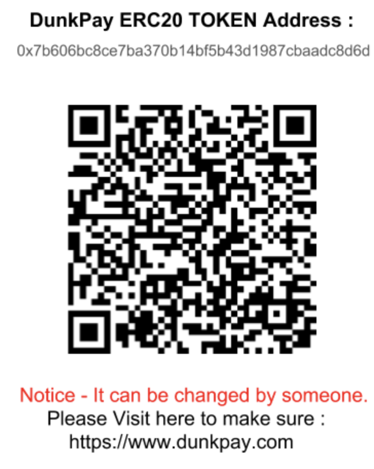
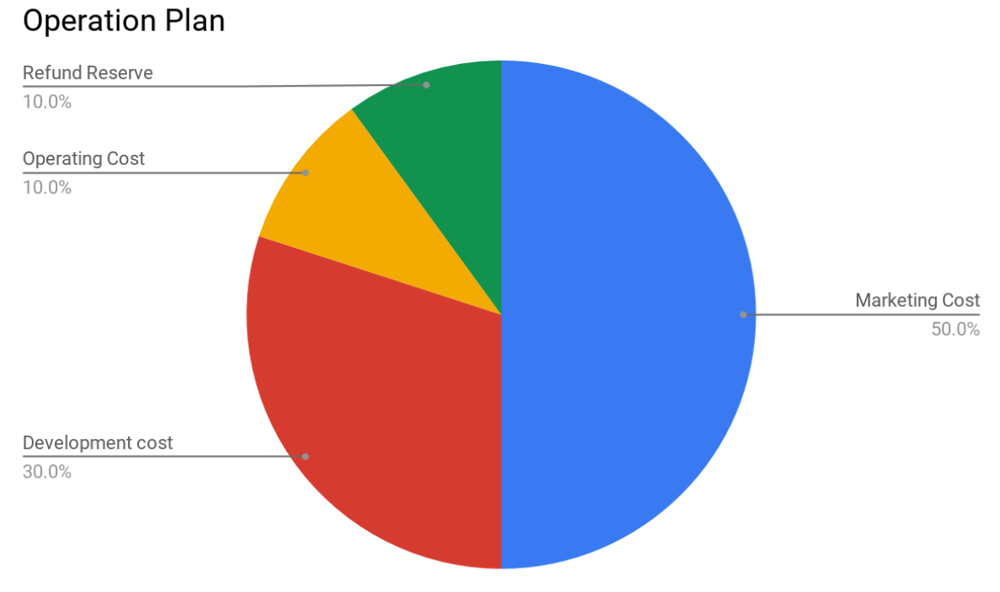

# 친애하는 여러분,

이 문서는 DunkPay 토큰 판매에 관련한 글 입니다. DunkPay는 암호화폐를 이용한 결제시스템 으로써 현재 서비스 중에 있습니다. DunkPay는 현재 BTC, BCH, ETH 암호화폐를  이용하여 결제할 수 있습니다. 사용자가 DunkPay를 통하여 결제를 하게 되면 1%의 수수료를 부과 합니다. 우리는 이 수수료를 얻을 권리를 토큰으로 판매하기로 결정 하였습니다. DunkPay는 운영 중인 서비스 입니다. 특정한 판매기간 이나 제약사항을 걸지 않습니다. 언제든지 환불도 가능합니다.

# ETH를 보내면 구매 , DNK를 보내면 환불

DunkPay 토큰을 구매 또는 판매 하는 것은 별도의 거래소가 필요 없습니다. 사용자가 스마트컨트랙트 주소로 ETH를 입금하면 DunkPay 토큰을 획득 할 수 있고, DNK를 입금하면 ETH를 환불 받을 수 있습니다. 구매, 환불, 파산 등 모든 기능은 스마트컨트랙트로 작동합니다.

<p align="center">
	<a href="https://etherscan.io/address/0x7b606Bc8ce7ba370b14BF5b43D1987Cbaadc8d6d">
	</a>
</p>

# DunkPay 토큰 (ERC20 - DNK)
```
전체 발행량 : 10,000,000 DNK
판매 발행량 : 4,900,000 DNK (49%)
추가 발행량 : 토큰보유자를 위한 PoS
```
# DunkPay 토큰 PoS (Proof-of-Stake)

룰은 매우 간단합니다. 매월 1일 (GMT 00:00 기준) 스냅샷을 진행합니다. 보유량/총발행량 을 기준으로 DunkPay 토큰 을 받게 됩니다. PoS를 위해서는 1,000 DNK 이상을 보유해야 합니다. (단 , 수수료 수입이 발생하지 않으면 이월될 수 있습니다.)
```
예 - 2018년 11월, DunkPay 수수료 총 매출 - 1,200 ETH * 1000 
2018년 12월 1일, 각 사용자에게 (보유량/총 발행량) * 1,200,000 DNK 를 받게됩니다.

5,000 DNK 보유자 = (5000/10000000) * 1200000 = 600 DNK 드랍
```
# DunkPay 토큰 단위 

Unit|Value|Jordan
 ------------- |-------------|:-----
 jordan (Jordan)     | 1 jordan | 1 
 Kjordan (Magic)     | 1e3 jordan | 1,000 
 Mjondan (Shaq)     | 1e6 jordan | 1,000,000 
 Gjordan (Kobe)     | 1e9 jordan | 1,000,000,000 
 microdunk (LeBron)     | 1e12 jordan | 1,000,000,000,000 
 millidunk (Stephan)    | 1e15 jordan | 1,000,000,000,000,000 
 dunk (DNK)     | 1e18 jordan | 1,000,000,000,000,000,000 

ETH 와 동일한 단위를 적용합니다. 1DNK는 1e18의 조단으로도 표현할 수 있습니다. 유감스럽게도 코비나 르브론은 조단의 적수가 되지 못합니다.

# DunkPay 토큰 계약 (구매)

고객은 스마트컨트랙트 주소로 ETH를 입금하면 즉시 DunkPay 토큰을 동일한 ETH주소로 토큰을 받습니다. 잔여 판매수량에 따라 최대 50%의 보너스를 적용받습니다.
```
1 ETH = (100% + (50% * 판매 잔여수량/총 발행량)) * 1000 DNK

예 - 총 10,000,000 DNK 에서 2,450,000 DNK가 남아있는 상황
1 ETH = (1 + (0.5 * 0.245)) * 1000 = 1,122 DNK
```
# DunkPay 토큰 환불 (판매)

고객은 스마트컨트랙트 주소로 DNK를 입금하면 즉시 ETH주소로 ETH를 환불 받습니다. 잔여 판매수량에 따라 최대 50%의 패널티를 적용받습니다.
```
1 DNK = (50% + (50% * 판매 잔여수량/총 발행량)) / 1000 ETH

예 - 총 10,000,000 DNK 에서 2,450,000 DNK가 남아있는 상황
1,125 DNK = (562 +(562 * 0.245)) / 1000 = 0.699 ETH
```
# DunkPay 토큰 종료 (파산)

DunkPay는 토큰의 환불준비금을 예치해야 할 의무를 가집니다. 단, 경영사정 악화로 환불준비금을 마련할 수 없는 경우 파산계약을 실행합니다. 첫번째 순서로 판매되지 않은 모든 토큰을 소각합니다. 나머지 DunkPay 토큰 보유자들에게 보유량 대비 모든 ETH를 에어드랍 하게됩니다.

# DunkPay 토큰 운영계획

운영계획은 매우 투명합니다. DunkPay 토큰판매가 성공적으로 이루어질 경우, 환불준비금(10%)을 제외한 나머지 ETH는 회사의 발전을 위해 집행 할 것입니다. 예상되어지는 집행비율은 다음과 같습니다.

<p align="center">
	
</p>

매월 첫날에 홈페이지와 이메일을 통해서 집행내용을 공개합니다.

# 최고의 시나리오

마케팅비용이 특정 수준(1,000,000 USD)을 넘어선다면 NBA 드림팀매치를 라스베가스에서 진행하겠습니다. 마이클 조던의 1992년 드림팀과 샤킬오닐의 1994년 드림팀의 대결을 기대합니다. 일정수량 이상의 DunkPay 토큰 보유자의 경우 무료VOD와 현장관람의 기회를 제공합니다.

# 마치는 글

현재 고수익을 보장하는 미래지향적인 토큰들이 판매되고 있습니다. 하지만, 당장 수익율을 기대할 수 있는 토큰은 찾아보기 힘든 것이 사실입니다. 우리는 여러분에게 공기 나 물처럼 보이지 않는 상품을 판매하지 않습니다. 당장 수익을 창출할 수 있는 토큰판매에 참여해 보세요. 당신은 보여지는 상품을 구매할 자격이 있습니다!


<br><br><br>